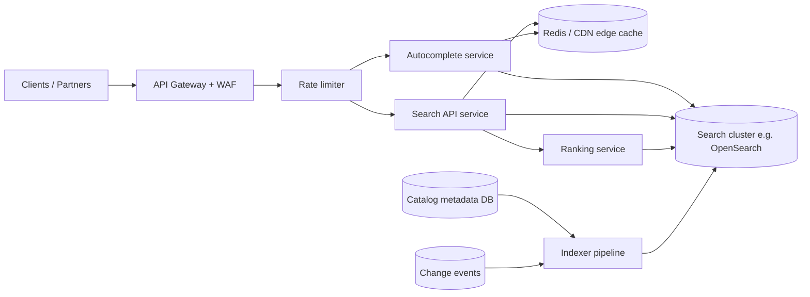

# Design a music streaming search API at scale

**Date:** 2026-05-20  
**Track:** Day B — System design exercise (hypothetical)  
**Status:** Published  
**Disclaimer:** This is a **design practice** based on public patterns (search indexes, CDNs, rate limiting), not insider knowledge of any company.

---

## Context

**Hypothetical:** If a global music streaming product had to expose a **public search API** for tracks, albums, and artists — used by mobile apps, web, and third-party integrations — how would you design it for low latency, high availability, and predictable cost at tens of millions of daily searches?

Users type partial queries (“taylor sw”, “bohemian”), expect sub-200ms suggestions, tolerate slightly slower full results, and must only see catalog content they are licensed to access in their region.

---

## Requirements

### Functional

- Search by track title, artist name, album name; support typo tolerance and prefix matching.
- Autocomplete / typeahead endpoint separate from full search (lighter payload).
- Filter by content type (track | album | artist), genre, explicit flag, availability in user region.
- Pagination for full results; stable sort (relevance default, optional popularity).
- Return stable IDs, display metadata, deep-link URIs — not audio bytes (playback is another service).

### Non-functional

- **Latency:** p95 &lt; 150ms for autocomplete; p95 &lt; 400ms for full search at peak.
- **Availability:** 99.95% for read path; degrade gracefully (cached popular queries) if index is slow.
- **Scale:** ~50k QPS peak on search; ~200k QPS peak on autocomplete globally.
- **Freshness:** New releases visible within 15 minutes; takedowns effective within 5 minutes.
- **Cost:** Bound expensive fan-out (no per-query full table scans).

---

## Constraints

- Catalog ~80M tracks; metadata changes continuously (licensing, regional rights).
- Cannot ship one giant inverted index in app memory; multi-region active-active preferred.
- Personalization (user taste) is **nice-to-have** for v1 — relevance can start mostly global + region.
- Third-party API keys need per-tenant rate limits and audit logs.

---

## High-level architecture

**Request path (autocomplete):** Gateway → rate limit → autocomplete service → edge cache (hot prefixes) → search index (edge n-grams / completion field) → trim to top 8 suggestions.

**Request path (full search):** Gateway → rate limit → search API → optional cache for normalized query hash → index query + lightweight ranking → enrich top N hits from catalog read model (batch by ID).

**Write path:** Catalog changes publish events → indexer updates search documents (partial updates for metadata, delete on takedown).

---

## Options considered

| Option | Pros | Cons |
|--------|------|------|
| **A. Single search cluster + Redis cache** | Simple ops; one query language (e.g. OpenSearch) | Hot keys on viral queries; cluster blast radius |
| **B. Separate autocomplete + full-search stacks** | Tune completion fields independently; smaller autocomplete payloads | Two indexes to keep in sync; more moving parts |
| **C. External managed search SaaS** | Fast to ship; built-in scaling | Cost at scale; less control over ranking; data residency |

## Recommendation

**Start with B** for anything expecting Spotify-scale query patterns: dedicated autocomplete index (completion suggester, aggressive caching) and a full-search index with richer analyzers (synonyms, fuzzy match, phonetic optional).

Use **API gateway rate limits** (token bucket per API key + per IP) in front of both. Add **normalized query cache** (Redis) for full search with short TTL (30–120s) for anonymous popular queries; **do not** cache personalized responses in v1.

Indexer: event-driven, idempotent updates keyed by `track_id`, with a **takedown fast path** (priority queue) that deletes or marks unavailable without waiting for batch reindex.

---

## Tradeoffs & non-goals

**Tradeoffs**

- **Consistency vs freshness:** Near-real-time index (seconds–minutes lag) beats strong consistency with catalog DB; brief stale results acceptable if takedown path is fast.
- **Relevance vs latency:** v1 uses index score + popularity boost; ML re-ranking later adds ~20–50ms — defer until metrics justify it.
- **Fuzzy matching cost:** Fuzzy queries on full search only; autocomplete stays prefix-only to protect p95.

**Non-goals (v1)**

- Searching lyrics text at scale (separate licensing and index size).
- Collaborative playlist search inside this API (different domain).
- Cross-user personalized ranking models.
- Returning audio streams from search endpoints.

---

## Failure modes

| Failure | Mitigation |
|---------|------------|
| Search cluster overload | Shed load: return cached top queries + “try again”; tighten fuzzy; circuit-breaker to read replicas |
| Index lag after release | Stale autocomplete for new album → monitor indexer lag; canary new docs before promoting |
| Cache poisoning | Cache key = normalized query + region + API tier; no user PII in keys |
| Bad deploy / mapping change | Blue/green index alias swap (`search_v12` → `search_v13`); rollback alias |
| Rate-limit bypass | Enforce at gateway and service; per-key quotas; alert on 429 ratio per tenant |

---

## Week 1 vs month 3

| Week 1 | Month 3 |
|--------|---------|
| Single-region OpenSearch, basic analyzers, REST search + autocomplete | Multi-region read replicas; synonym file; popularity boost |
| API gateway + fixed rate limits | Per-partner tiers, burst allowances, usage dashboards |
| Batch nightly full reindex | Event-driven incremental index + priority takedown queue |
| Manual relevance spot-checks | Search quality metrics (click-through, zero-result rate), A/B on ranking |

---

## My review notes

**2-minute summary:** Split autocomplete (fast, prefix-only) from full search (fuzzy, richer ranking). Put rate limits at the gateway, cache hot anonymous queries, and update the search index from catalog events — with a fast takedown path. Week 1 is one region and nightly reindex; month 3 adds multi-region, incremental indexing, and quality metrics.
