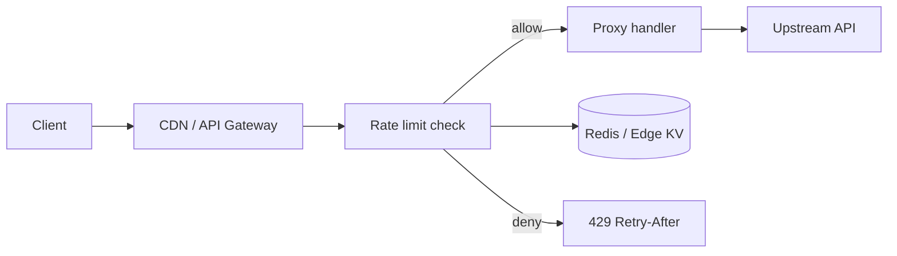

# Design a rate-limited public API proxy

**Date:** 2026-05-23  
**Track:** Day B — System design exercise (hypothetical)  
**Status:** Draft — review before merge  
**Disclaimer:** Design practice from public patterns — not insider knowledge of any company.

---

## Context

**Hypothetical:** If a team shipped a **public HTTP proxy** (like a CORS gateway or third-party API wrapper) on serverless or edge, how would you add **fair rate limiting** so one client cannot burn your quota, trigger upstream bans, or inflate your bill?

Typical users: browser apps (per origin), mobile apps (API keys), and occasional scripts (stricter caps).

---

## Requirements

### Functional

- Proxy `GET`/`POST` to allowed upstream paths only (allowlist).
- Identify callers: API key header, or anonymous IP + optional origin.
- Return **429** with `Retry-After` when over limit; **401** for missing/invalid key on protected routes.

### Non-functional

- **Latency:** rate check adds &lt; 5ms p95 at edge.
- **Accuracy:** acceptable **per-key approximate** limits (not perfect global counts).
- **Availability:** limiter failure should **fail open or closed** — product choice (see tradeoffs).
- **Scale:** 10k+ keys, 100k+ RPS aggregate across regions.

---

## Constraints

- Serverless functions are stateless — counters need Redis, edge KV, or gateway-native limits.
- Upstream (e.g. music API) has its own rate cap — your proxy must stay under it globally.
- Browser clients cannot hide secrets — tier “browser” lower than “server” keys.

---

## High-level architecture

**Flow:** Extract `X-API-Key` or client IP → build limit key → **INCR** token bucket or sliding window in Redis → if allowed, forward request; else 429.

---

## Options considered

| Option | Pros | Cons |
|--------|------|------|
| **A. Token bucket (Redis)** | Smooth bursts; well understood | Redis latency; hot keys for viral clients |
| **B. Fixed window per minute** | Simple `INCR` with TTL | Spike at window boundary |
| **C. Sliding window log** | Fairer | More memory per key |
| **D. Gateway-only (Cloudflare/Vercel limits)** | No app code | Coarse; hard per-route rules |

## Recommendation

**Redis token bucket per API key** (and stricter bucket per IP for anonymous), plus **gateway WAF** as first line (block obvious abuse).

- Keys: `rl:{keyId}:{window}` or Lua script for atomic token debit.
- Tiers: `free` 60 req/min, `app` 600 req/min, `server` 6000 req/min.
- Global upstream budget: separate counter `rl:global:upstream` capped below vendor limit.

---

## Tradeoffs & non-goals

**Fail closed vs open**

- **Closed:** Redis down → 503 (safer for cost).
- **Open:** Redis down → allow traffic (safer for UX). Pick one and document.

**Non-goals (v1)**

- Per-user OAuth quotas inside the proxy.
- Geographic sharding of counters (unless traffic requires it).
- Billing metering (only limiting).

---

## Failure modes

| Failure | Mitigation |
|---------|------------|
| Hot key on one API key | Shard counter `keyId:shard(n)`; local edge cache for “already over limit” |
| Clock skew across regions | Use Redis TTL windows; avoid client clocks |
| Retry storms after 429 | Honor `Retry-After`; exponential backoff in client docs |
| Bypass via rotating IPs | Require API key for production; CAPTCHA or stricter IP /24 limits for anon |

---

## Week 1 vs month 3

| Week 1 | Month 3 |
|--------|---------|
| Fixed window per IP in gateway | Token bucket per key in Redis + tiers |
| Single region Redis | Multi-region with eventual consistency + global cap |
| Manual key issuance | Self-serve keys, dashboards, 429 analytics |

---

## My review notes

**2-minute summary:** Public proxy needs **identity** (key or IP), **counters in Redis** (token bucket), and **429 + Retry-After**. Add a **global cap** so you never exceed upstream limits. Decide fail-open vs fail-closed when Redis is down.
