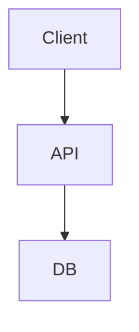

# Hypothetical: Design real-time playlist collaboration

**Date:** 2026-05-26  
**Track:** Day B — System design exercise (hypothetical)  
**Disclaimer:** This is a **design practice** based on public patterns, not insider knowledge of any company.

---

## Context

Public design exercise: Design real-time playlist collaboration.

## Requirements

- Functional: TODO
- Non-functional: TODO: scale, latency, cost

## Constraints

TODO

## High-level architecture

## Options considered

| Option | Pros | Cons |
|--------|------|------|
| Monolith | | |
| Microservices | | |

## Recommendation

TODO after review

## Tradeoffs & non-goals

TODO

## Failure modes

TODO

## Week 1 vs month 3

| Week 1 | Month 3 |
|--------|---------|
| MVP scope | Hardening and scale |

---

## My review notes (fill before merge)

_What I disagree with or would change:_
